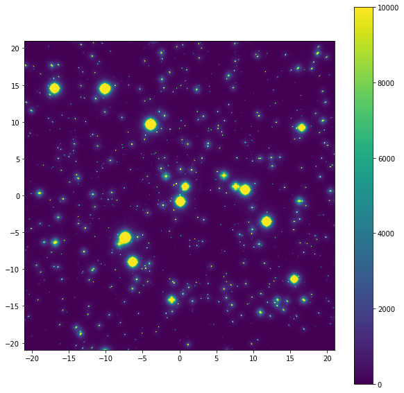

# Getting Started With MAVISIM

A simple example script is provided in the form of a Jupyter Notebook in the github repo: `mavisim.ipynb`. Once the data dependencies are downloaded (see [install](install.md) for more info), the notebook can be ran:
```bash
jupyter notebook mavisim.ipynb
```
Going through each section of this notebook illustrates the intended use of MAVISIM.

## Imports
```python
# Standard
import numpy as np
import matplotlib.pyplot as plt

# Astropy
from astropy.io import fits, ascii

# This is where our simulation parameters are defined:
import input_parameters as input_par

# MAVISIM modules and functions required:
from mavisim.generate_image import ImageGenerator
from mavisim.source import Source
from mavisim.noise import add_all_noise
```

## Create the source object (to populate the image)
Here we define the source objects to be used in the generation of the MAVIS image, as well as the exposure time of the simulated observation.
```python
exp_time = 30 # seconds
source = Source(input_par, exp_time, static_dist=True)
source.build_source()
```

## Create the Noise-Free Image with E2E PSF
This process is summarised in 3 main steps:

- Initialise ImageGenerator object
- Generate image,
- Rebin to desired pixel scale.


This is usually the longest part of the MAVISIM pipeline, taking about 15 minutes on modest hardware for the ~4000 objects in this example. The duration scales roughly linearly with number of objects. A GPU-optimised CUDA version of this module is under development and is expected to be released very soon. A beta version can be found on the [v1.1dev-gpu](https://github.com/smonty93/MAVISIM/tree/v1.1dev-gpu) branch on Github.

```python
image_gen = ImageGenerator(array_width_pix=12800, source=source,
                            psfs_file="data/e2e_psfs_100s_lqg_optsquare.fits")
image_gen.main()
image_final = image_gen.get_rebinned_cropped(rebin_factor=2,cropped_width_as=30.0)

print (image_final.shape)
# (4000,4000)
```

## Add all noise
Here we take the raw noiseless simulated image and pass it through the major sources of noise:
- Sky background,
- Photon noise,
- Read-out noise.

```python
image_allnoise = add_all_noise(input_par, image_final, source.exp_time)
```

## Plot/save the final image and input catalogue
```python
image_final_noise = np.array(image_allnoise, dtype="float32")

# plot final image:
extent = 42*np.array([-0.5,0.5,-0.5,0.5])
plt.figure(figsize=[10,10])
plt.imshow(image_final_noise, extent=extent)
plt.colorbar()
plt.clim([0,10000])

hdu = fits.PrimaryHDU(image_final_noise)
hdul = fits.HDUList([hdu])
hdul.writeto("output_image_001.fits", overwrite=True)
```

